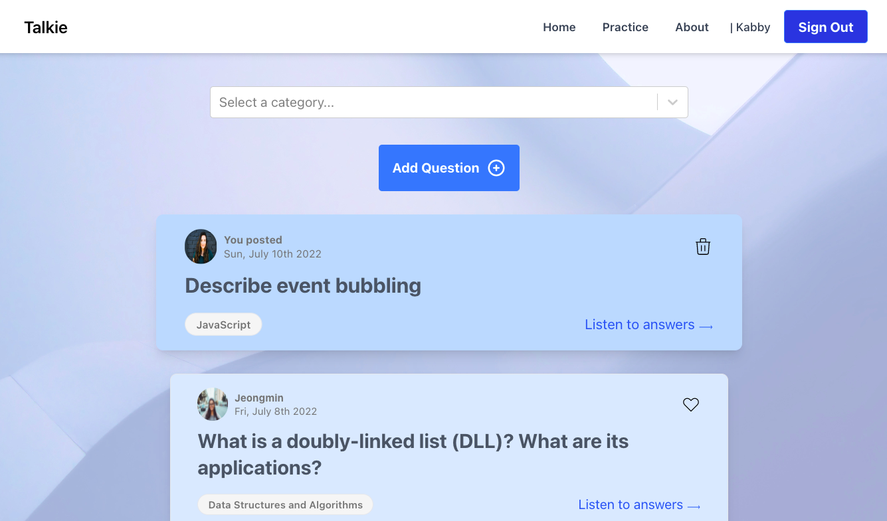

# Talkie

An app that helps users prepare for tech interviews by allowing them record audio answers to interview questions, other users provide feedback to the answers.

## Tech Stack

Front-End: React, JavaScript, Axios, JSX, HTML, SASS, Webpack

Back-End: Express, Node.js, PostgreSQL

## Final product

### Main Page With Questions

### Add Question Form

### Add Answer Page

### Comments Page

